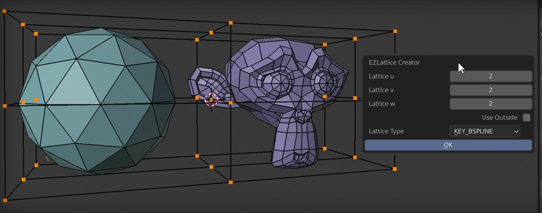

# EZ Lattice Free

A Blender addon for quickly creating a lattice around selected vertices for fast and easy shape editing.

## Description

EZ Lattice Free streamlines the process of using lattice deformers in Blender. Instead of manually creating a lattice object, sizing and positioning it, and then adding a modifier to your mesh, this addon automates the entire setup.

With a few clicks, you can generate a perfectly sized lattice around your selected vertices in Edit Mode, immediately start deforming, and then apply the changes just as quickly.

## Features

-   **Quick Lattice Creation**: Generates a lattice that perfectly bounds the selected vertices of your mesh.
-   **Interactive Setup**: A popup dialog allows you to define the lattice's U, V, and W divisions and its interpolation type.
-   **Automatic Modifier**: Automatically adds and configures a Lattice modifier on the target object.
-   **Streamlined Workflow**: Switches you directly into Edit Mode for the new lattice, so you can start deforming immediately.
-   **Apply or Clear**: Easily apply the lattice deformation to your mesh or clear the lattice and modifier to start over.
-   **Context Menu Integration**: Accessible via the right-click context menu in Edit Mode for meshes and lattices.

## Installation

1.  Download the latest release as a `.zip` file.
2.  In Blender, go to `Edit` > `Preferences`.
3.  Navigate to the `Add-ons` section.
4.  Click the `Install...` button at the top.
5.  Select the downloaded `.zip` file and click `Install Add-on`.
6.  Find "EZ Lattice Free" in the add-on list and enable it by checking the box.

## How to Use

### Creating a New Lattice

1.  Select your mesh object and go into **Edit Mode**.
2.  Select the vertices, edges, or faces you wish to deform.
3.  Right-click in the 3D Viewport to open the context menu.
4.  Go to **Easy Lattice Menu** > **New**.
5.  The **EZLattice Creator** dialog will appear. Configure the lattice divisions (`u`, `v`, `w`) and the `Lattice Type`.
6.  Click **OK**.
7.  A new lattice object is created, and you are automatically switched to Edit Mode for that lattice.
8.  Deform the lattice control points to modify your mesh.

### Applying the Lattice

1.  With the lattice object selected, go into **Edit Mode**.
2.  Right-click to open the context menu.
3.  Go to **Easy Lattice Menu** > **Apply**.
4.  The lattice deformation will be applied to the mesh, the lattice modifier will be removed, and the temporary lattice object will be deleted. You will be returned to your original mesh object.

This workflow allows for a fast, iterative approach to shaping meshes with lattices.
